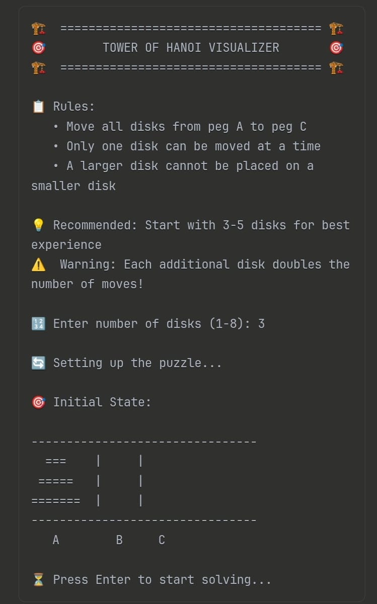
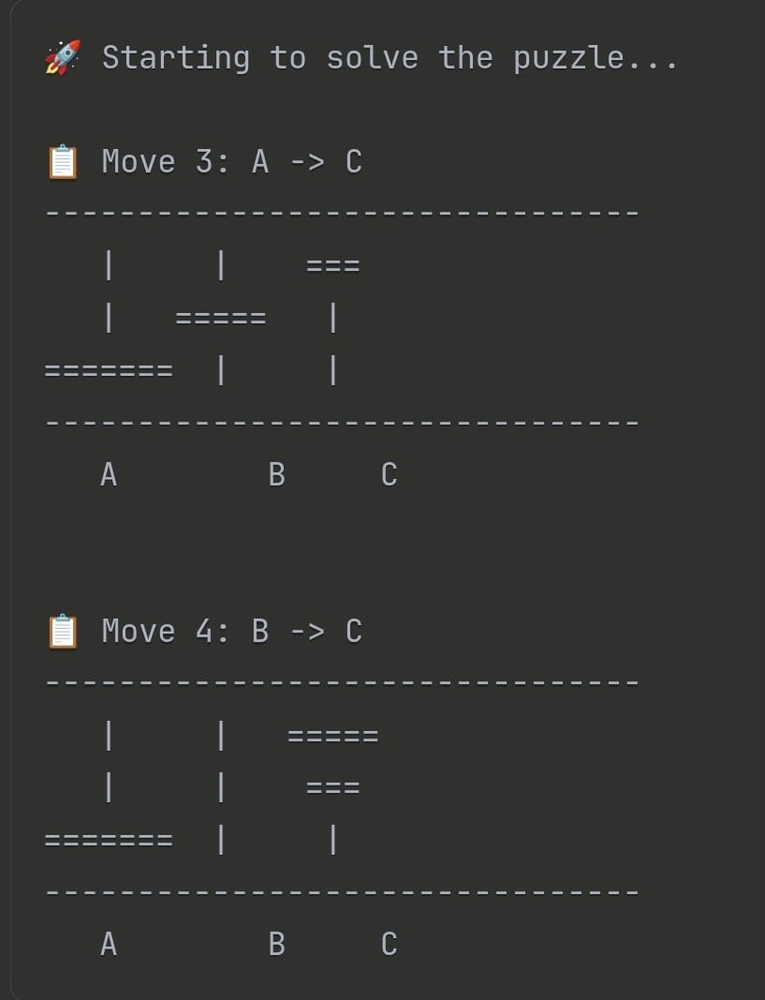
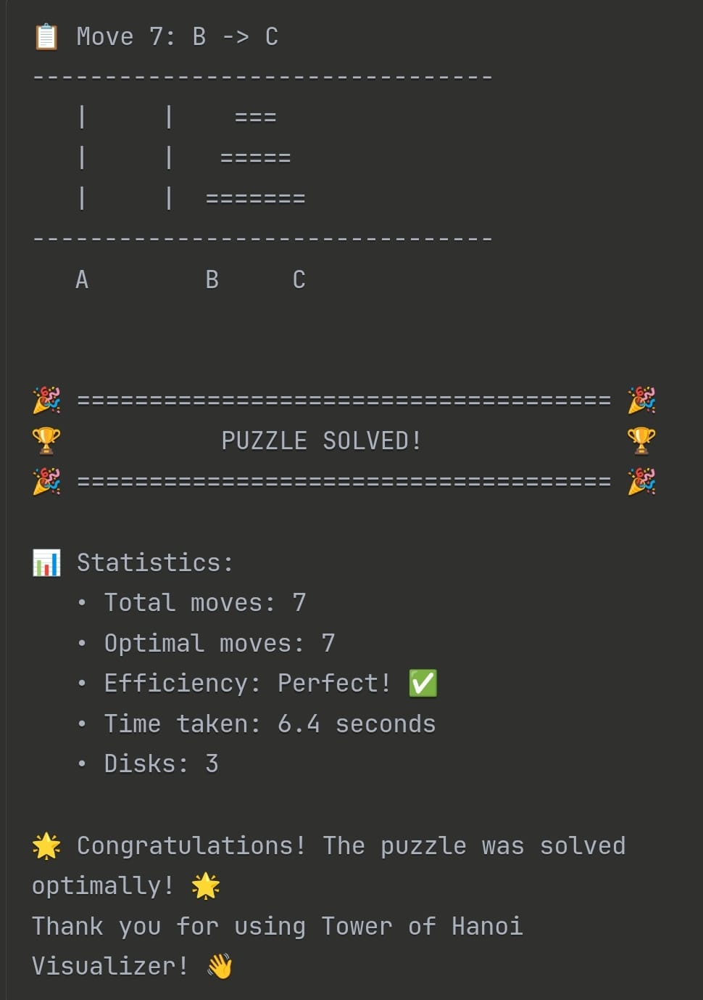

# Tower of Hanoi Visualizer

## Description
A C++ implementation of the classic Tower of Hanoi puzzle with real-time ASCII visualization. The program solves the puzzle recursively and displays each move step-by-step with beautiful ASCII art representation of the towers and disks.

## Features
- Interactive input for number of disks (1-8 recommended for best visualization)
- Real-time ASCII visualization of all three pegs (A, B, C)
- Step-by-step move display with move counter
- Animated transitions with customizable delay
- Move validation and optimal solution verification
- Clean, colorful terminal output
- Displays total moves vs optimal moves comparison

## Requirements
- C++11 or later
- GCC compiler (g++) or any modern C++ compiler
- Terminal/Console that supports basic ASCII characters
- Windows/Linux/macOS compatible

## How to Compile and Run

### Method 1: Using g++ (Recommended)
```bash
# Clone the repository
git clone https://github.com/PRANAVZALKE/tower-of-hanoi-visualizer.git

# Navigate to source directory
cd tower-of-hanoi-visualizer/src

# Compile the program
g++ -std=c++11 -o hanoi main.cpp

# Run the program
./hanoi
```

### Method 2: Using make (if Makefile provided)
```bash
cd tower-of-hanoi-visualizer/src
make
./hanoi
```

## How to Use
1. Run the program
2. Enter the number of disks when prompted (3-5 recommended for beginners)
3. Watch as the algorithm solves the puzzle automatically
4. Each move is displayed with the current state of all three towers
5. The program shows the total moves taken and compares with optimal solution

## Sample Input/Output
```
Enter number of disks: 3

Initial State:
--------------------------------
  ===    |     |  
 =====   |     |  
=======  |     |  
--------------------------------
   A        B     C   


Move 1: A -> C
--------------------------------
   |     |    ===
 =====   |   =====
=======  |  =======
--------------------------------
   A        B     C   

...

Solved in 7 moves. (Optimal = 7)
```

## Algorithm
The program uses the classic recursive algorithm for Tower of Hanoi:
1. Move n-1 disks from source to auxiliary peg
2. Move the bottom disk from source to destination peg
3. Move n-1 disks from auxiliary to destination peg

**Time Complexity:** O(2^n)  
**Space Complexity:** O(n) for recursion stack

## Screenshots

*Starting position with all disks on peg A*


*Algorithm in action showing intermediate steps*


*Completed puzzle with all disks moved to peg C*

## Project Structure
```
tower-of-hanoi-visualizer/
├── README.md
├── src/
│   └── main.cpp
├── screenshots/
│   ├── initial_state.png
│   ├── solving_process.png
│   └── final_state.png
└── .gitignore
```

## Customization
You can modify the following parameters in the code:
- **Delay between moves**: Change `chrono::milliseconds(500)` value
- **Maximum disks**: Modify input validation
- **Visual representation**: Customize the `printDisk` function for different characters

## Educational Value
This project demonstrates:
- Recursive problem solving
- Data structures (vectors, stacks)
- Algorithm visualization
- C++ programming concepts
- Time and space complexity analysis

## Troubleshooting
- **Compilation errors**: Ensure you have C++11 or later
- **Display issues**: Try reducing the number of disks for smaller terminals
- **Slow animation**: Reduce the delay in `sleep_for()` function

## Author
Pranav Arvind Zalke

CSE AI/DS Student  

PIET

Parul University

## License
This project is open source and available under the MIT License.

## Acknowledgments
- Classic Tower of Hanoi puzzle by Édouard Lucas (1883)
- Recursive algorithm implementation
- ASCII art visualization techniques
